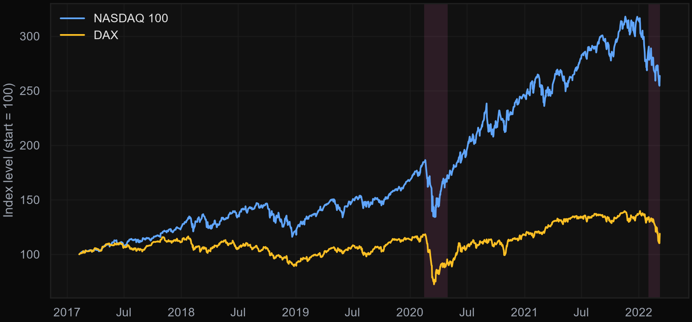
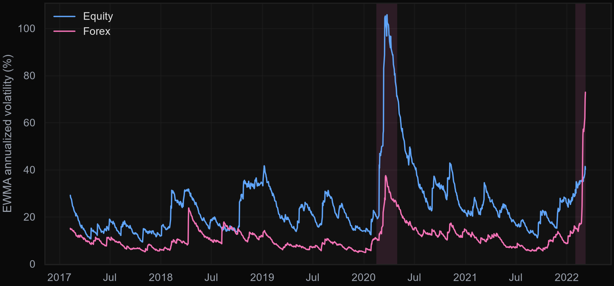
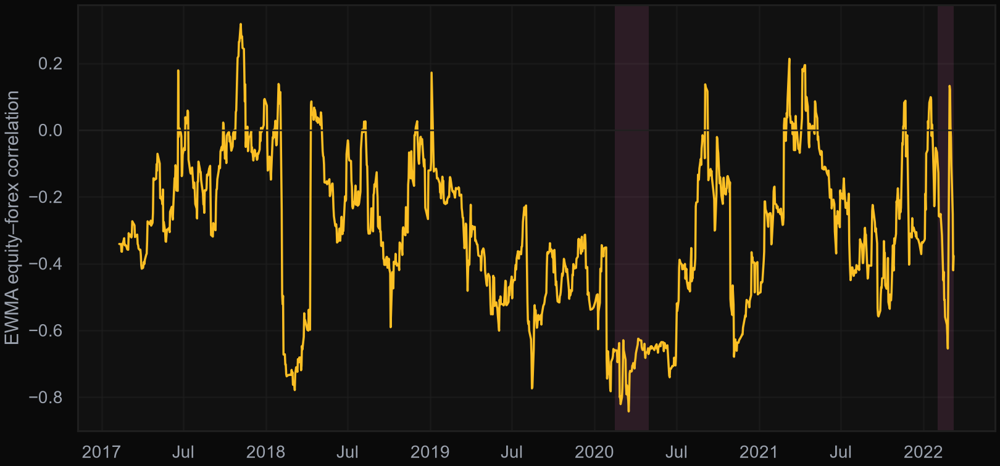
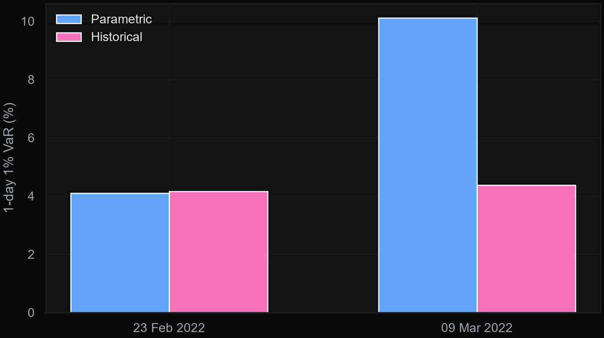

# Market Risk Analysis - Value-at-Risk Framework

[](https://github.com/omarja12/Market_Risk/actions/workflows/ci.yml)
[](LICENSE)
[](requirements.txt)

**🔗 Live site: [omarja12.github.io/Market_Risk](https://omarja12.github.io/Market_Risk/)** — overview, formulas, charts, and a getting-started guide.

A comprehensive quantitative analysis implementing Value-at-Risk (VaR) methodology for a multi-currency, multi-asset portfolio. The project analyzes just over 5 years of market data using EWMA volatility estimation and dual VaR approaches (parametric and historical).

## Overview

**Portfolio Composition:**
- 60% US equity exposure (NASDAQ 100, β = 1.6)
- 40% German equity exposure (DAX, β = 1.3)
- Dual currency risk (USD/RUB and EUR/RUB)

**Time Period:** February 9, 2017 - March 9, 2022 (~5 years)

**Analysis Date:** March 9, 2022

**Methodologies:** Parametric VaR, Historical VaR, EWMA volatility estimation



## Data

**File:** `2122_RM_Data.xlsx`

Daily observations including:
- NASDAQ 100 index values
- DAX index values  
- USD/RUB exchange rates
- EUR/RUB exchange rates

The dataset spans two major market events:
- COVID-19 pandemic (March 2020)
- Russia-Ukraine conflict (February 2022)

## Methodology

### Risk Decomposition

Portfolio returns are decomposed into equity and forex components:

```
Return(RUB) = Return(Equity) + Return(Forex)
```

This additive model allows separate analysis of market risk and currency risk.

### Volatility Estimation

EWMA (Exponentially Weighted Moving Average) with smoothing parameter λ = 0.94:

```
σ²ₜ = (1 - λ)r²ₜ₋₁ + λσ²ₜ₋₁
```

The recursive formula emphasizes recent observations (6% weight) while maintaining historical context (94% weight).

### VaR Calculation

**Parametric VaR:**
- Assumes normally distributed returns
- Calculates quantile using standard normal distribution
- Formula: VaR = μ - σ × Z₁₋ₐ

**Historical VaR:**
- Uses empirical distribution of historical returns
- Identifies α-th percentile from sorted returns
- No distributional assumptions

Both methods calculated at 1% significance level (99% confidence).

## Key Findings

### Volatility Analysis

- EWMA volatility increased 3-5x during crisis periods
- Volatility clustering evident around market shocks
- Mean reversion observed during recovery periods



### Correlation Dynamics

- Equity–forex correlation is **negative** across the whole sample (roughly +0.3 to -0.8), not positive
- It moves further negative during crises — currency moves partly offset equity losses instead of compounding them
- This acts as a natural hedge for a ruble-based investor holding foreign equities



### VaR Estimates

- 1-day 1% Parametric VaR rose from ~4.1% (23 Feb 2022) to ~10.1% (9 Mar 2022) as EWMA volatility reacted to the shock
- 1-day 1% Historical VaR barely moved over the same window (~4.2% → ~4.4%), since it reflects the full return history rather than the latest shock
- 10-day VaR scales by exactly √10 over the 1-day figure (a property of the model, assuming i.i.d. returns)



### Event Analysis

**COVID-19 (Feb–Mar 2020, peak to trough):**
- NASDAQ fell ~28%, DAX fell ~39%
- Equity EWMA volatility spiked ~4-5x to ~106% annualized
- Equity–forex correlation dropped toward -0.8

**Russia-Ukraine (23 Feb – 9 Mar 2022):**
- DAX fell ~5%, NASDAQ was roughly flat
- USD/RUB and EUR/RUB depreciated 38-48%
- Net portfolio effect: ruble-denominated value *rose* ~30-50%, since equity and forex returns are negatively correlated

## Project Structure

```
Project_Market_Risk_v6.ipynb    # Complete Jupyter notebook with analysis
2122_RM_Data.xlsx               # Historical market data
Market_Risk_Report.pdf          # Detailed findings and charts
README.md                       # This file
LICENSE                         # MIT license
requirements.txt                # Python dependencies
docs/                           # Live documentation website (GitHub Pages)
```

## Technical Implementation

**Language:** Python 3.x

**Libraries:**
- Pandas: Data manipulation and time-series analysis
- NumPy: Numerical computing
- Matplotlib: Visualization
- Seaborn: Statistical graphics
- SciPy: Statistical functions

**Key Calculations:**
- Log returns computation
- EWMA volatility recursion
- Covariance matrix estimation
- Correlation analysis
- Quantile calculation

## Results

The analysis produces:
- Time-series plots of market indices and exchange rates
- Volatility evolution charts
- Correlation heatmaps
- VaR estimates for different time horizons
- Comparative analysis of parametric vs. historical VaR

All results are contained in the Jupyter notebook and PDF report, and the key charts are also on the [Results page](https://omarja12.github.io/Market_Risk/results.html) of the live site.

## Files

- `Project_Market_Risk_v6.ipynb` - Complete analysis with code and output
- `2122_RM_Data.xlsx` - Historical NASDAQ, DAX, and forex data
- `Market_Risk_Report.pdf` - Professional report with findings
- `README.md` - This documentation
- `docs/` - Live documentation website ([omarja12.github.io/Market_Risk](https://omarja12.github.io/Market_Risk/))

## Usage

Open `Project_Market_Risk_v6.ipynb` in Jupyter and run cells sequentially. The notebook includes:
1. Data loading and cleaning
2. Return calculations
3. Volatility estimation
4. VaR calculation
5. Comparative analysis
6. Visualizations

Install dependencies first with `pip install -r requirements.txt`.

## Validation

The analysis validates assumptions and methodologies through:
- Comparison of parametric and historical VaR
- Testing across multiple time periods
- Stress testing with major market events
- Normality testing of returns distributions
- Correlation stability analysis

## Technical Notes

**Returns Calculation:** Log returns used throughout (continuous compounding)

**Missing Data:** Trading days only (weekends and holidays excluded)

**Initial Observations:** First observation excluded (no prior day for return calculation)

**Usable Sample:** 1,233 daily returns across the sample period

## References

- Basel Committee on Banking Supervision (2019), ["Minimum Capital Requirements for Market Risk"](https://www.bis.org/bcbs/publ/d457.htm) — the current regulatory framework behind the 99% confidence / 1% significance level used throughout.
- Basel Committee on Banking Supervision (1996), ["Amendment to the Capital Accord to Incorporate Market Risks"](https://www.bis.org/publ/bcbs24.htm) — the original text that made VaR a bank capital requirement.
- J.P. Morgan/Reuters (1996), *RiskMetrics — Technical Document*, 4th ed. — source of the EWMA volatility/covariance recursion (λ = 0.94) used for the volatility and correlation estimates ([overview](https://en.wikipedia.org/wiki/RiskMetrics)).
- Boudoukh, J., Richardson, M., and Whitelaw, R. (1998), ["The Best of Both Worlds: A Hybrid Approach to Calculating Value at Risk,"](https://papers.ssrn.com/sol3/papers.cfm?abstract_id=51420) *Risk*, 11(5), 64–67 — the age-weighted historical simulation method used in the EWMA-weighted historical VaR calculation.
- Jorion, P. (2007), *Value at Risk: The New Benchmark for Managing Financial Risk*, 3rd ed., McGraw-Hill — general reference for the parametric vs. historical VaR comparison and horizon scaling.
- Hull, J. C., *Risk Management and Financial Institutions*, Wiley — general reference for volatility modeling and market risk measurement.

## License

Released under the [MIT License](LICENSE).

---

**Analysis Date:** March 9, 2022  
**Data Period:** February 9, 2017 - March 9, 2022  
**Confidence Level:** 99% (1% significance)
